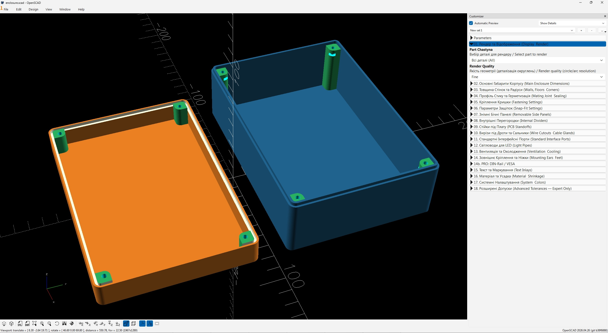
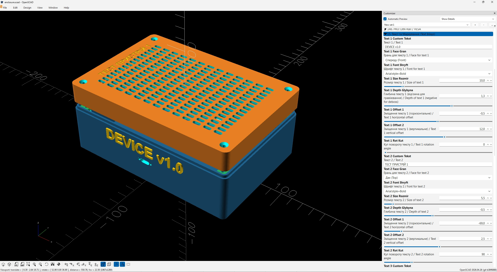
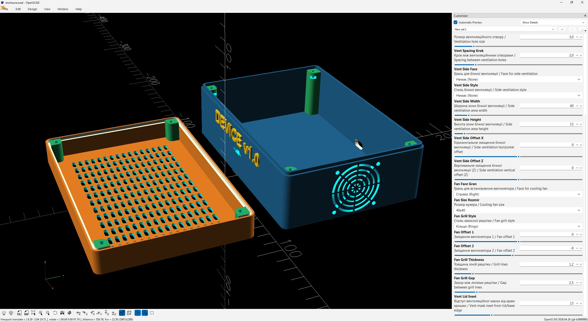
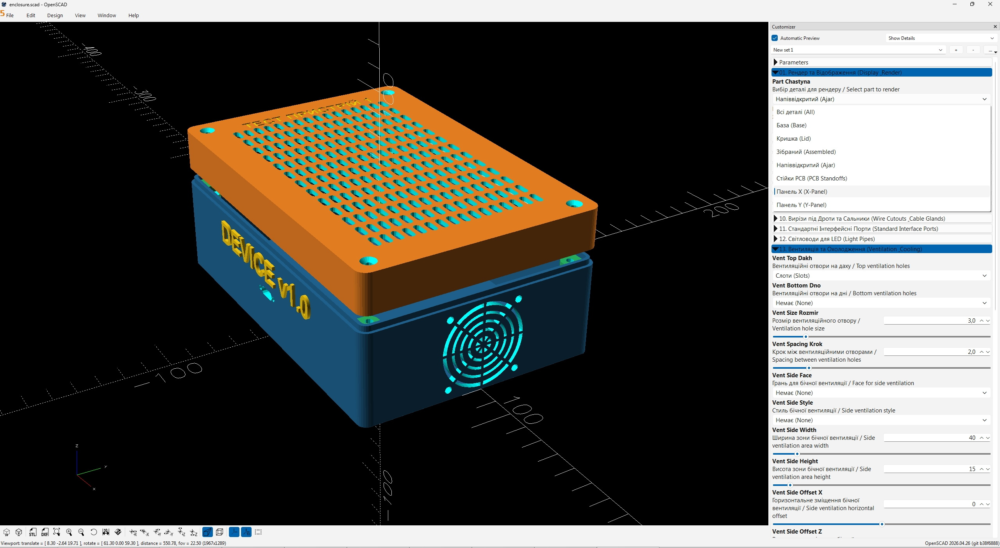
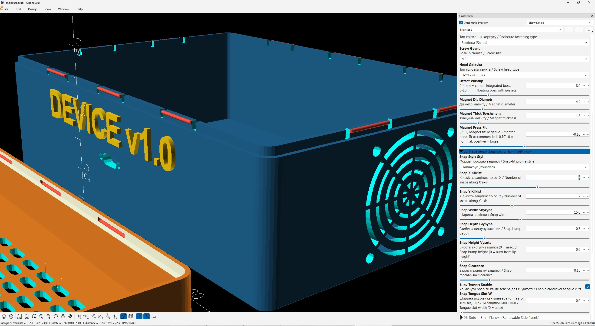
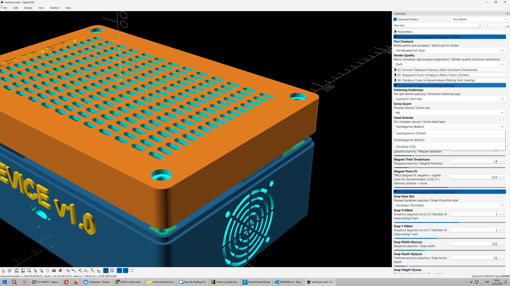
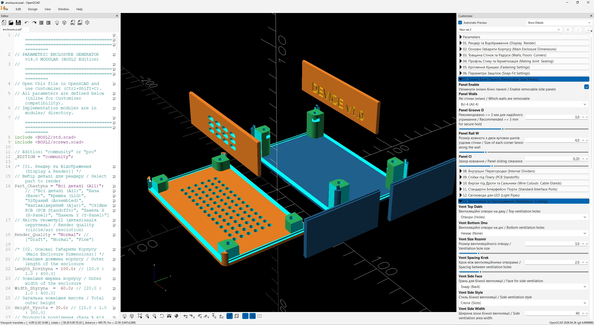

<div align="center">

# 📦 Parametric Enclosure Generator

### Generate professional 3D-printable electronics enclosures in minutes — no CAD skills required

[](https://openscad.org)
[](LICENSE)
[](https://belik.gumroad.com/l/idxwoz)
[](https://github.com/Belik1982/BOSL2_clodecode_COMMUNITY)

<br>



*Base and lid, PCB standoffs, rounded corners — rendered in OpenSCAD Customizer*

</div>

---

## What Is This?

A single OpenSCAD file with **130+ parameters** that generates a complete, ready-to-print enclosure for your electronics project. Open the file, adjust sliders in the Customizer panel, press **F6** — get an STL.

No scripting. No CAD experience. No subscription. Just sliders and dropdowns.

---

## Gallery

<table>
<tr>
<td width="50%">


**Custom text labels** — emboss or deboss on any face, multiple fonts

</td>
<td width="50%">


**Ventilation patterns** — slots, holes, or honeycomb on top/bottom/sides

</td>
</tr>
<tr>
<td width="50%">


**Fan mounts** 🔒 — 30/40/60/80/120 mm with 5 grill styles, any face

</td>
<td width="50%">


**Snap-fit fastening** 🔒 — parametric cantilever clips, no screws needed

</td>
</tr>
<tr>
<td width="50%">


**26 connector cutouts** 🔒 — USB, HDMI, XLR, XT60, IEC, aviation and more

</td>
<td width="50%">


**Removable panels** 🔒 — tongue-and-groove snap-in walls, slide from the side

</td>
</tr>
</table>

---

## Features

### 🆓 Free (this version)

| Feature | Details |
|---|---|
| **Enclosure sizes** | 20–400 mm on any axis |
| **5 ready presets** | Micro-Dongle → Sensor (50×35 to 85×50 mm) |
| **3 joint types** | Flat · Lip · Ledge |
| **Self-tap screws** | M2 / M2.5 / M3 / M4, any corner count |
| **6 connectors** | USB-C, USB-A, DC Jack, Jack 3.5 mm, RJ45, HDMI |
| **Top/bottom ventilation** | Slots · Holes · Honeycomb |
| **Text labels** | 2 fields, 3 fonts, emboss or deboss |
| **Internal dividers** | X-axis or Y-axis partition wall |
| **Wire cutouts** | Circle · Slot, any face |
| **Materials** | PLA · PETG with auto shrinkage compensation |
| **Preview colors** | Base/lid color customization |

### 🔒 PRO — [Get it on Gumroad →](https://belik.gumroad.com/l/idxwoz)

| Feature | Details |
|---|---|
| **All 15 size presets** | Micro-Dongle → Maxi 250×180×100 |
| **All 26 connectors** | USB, D-Sub, XLR, Speakon, XT30/60, IEC C8/C14, GX16/20, MIDI… |
| **5 fastening types** | Magnets · Snap-fit · Heat-set inserts · Hex nuts · Self-tap |
| **IP54 gasket groove** | O-ring channel for sealed enclosures |
| **Fan mounts** | 30/40/60/80/120 mm, 5 grill styles, any face |
| **Side wall ventilation** | Slots/Holes/Honeycomb on any side face |
| **Removable panels** | Tongue-and-groove slide-in walls |
| **PCB standoffs** | M2/M2.5/M3, grid or corner layout |
| **DIN rail TS-35** | Snap-on clip for panel mounting |
| **VESA mount** | 75×75 or 100×100 mm |
| **Mounting ears** | 2 or 4 ears, front/back/sides |
| **Keyhole slots** | Wall-mount keyhole pattern |
| **Rubber feet** | Pad bumpers or recessed sockets |
| **LED light pipes** | Up to 6 integrated light guides |
| **4 text fields · 12 fonts** | Full label control on all faces |
| **ABS / ASA / Custom** | Shrinkage compensation for all materials |
| **Cable glands** | M12 · M16 · M20 threaded entries |
| **Bill of materials** | Auto BOM + print time hints in console |

<div align="center">

### [🛒 Buy PRO on Gumroad](https://belik.gumroad.com/l/idxwoz)

*One-time purchase · Lifetime updates · Full OpenSCAD source*

</div>

---

## Quick Start

> ⚠️ **The project folder path must contain Latin characters only.**  
> `C:\Projects\enclosure` ✅ — `C:\Проекти\enclosure` ❌

### 1. Install OpenSCAD

Download the **development snapshot** from [openscad.org/downloads](https://openscad.org/downloads.html) — it includes the **Manifold** backend which renders 10–50× faster than the stable release.

After installing:  
`Edit → Preferences → Features → enable "manifold" → restart`

### 2. Open the Project

```
File → Open → enclosure.scad
Ctrl+Shift+C          open Customizer panel
F5                    quick preview
F6                    full render (use for STL export)
File → Export → Export as STL
```

### 3. Start Designing

The Customizer panel has 17 parameter groups. Work top to bottom:

```
01. Display & Render    ← choose what to show (Base / Lid / Assembled…)
02. Main Dimensions     ← length · width · height
03. Walls & Corners     ← wall thickness, corner radius
04. Joint Profile       ← Flat / Lip / Ledge
05. Fastening           ← screws, magnets, snaps, heat-set…  🔒
...
```

---

## Connector Reference

**USB:** USB-A · USB-A Dual · USB-B · USB-C · Micro-USB · Mini-USB  
**Video/Data:** HDMI · Mini-HDMI · RJ45  
**D-Sub:** DB9 (DE-9) · DB15 (DA-15) · DB-25  
**Audio:** XLR 3-pin · XLR 5-pin · Speakon NL4 · Jack 3.5 mm · Jack 6.35 mm · MIDI DIN-5  
**Power:** DC Jack M8 · M11 · XT30 · XT60 · IEC C14 · IEC C8  
**Circular:** GX16 Aviation · GX20 Aviation  

> All cutout dimensions verified against manufacturer datasheets  
> (IEC 60320, EIA-574, ISO 273, connector manufacturer specs)

---

## Size Presets

| # | Name | Size (L×W×H mm) | Typical Use |
|---|---|---|---|
| 1 | Micro-Dongle | 50×35×22 | USB dongles, BLE modules |
| 2 | Pocket | 64×41×20 | Keyfobs, small sensors |
| 3 | KeyFob | 80×45×16 | Slim remotes |
| 4 | Mini-Gauge | 100×60×25 | Arduino Nano, ESP32 |
| 5 | Sensor | 85×50×21 | IoT nodes, sensor packs |
| 6–15 | … | up to 250×180×100 | 🔒 PRO only |

---

## Materials & Shrinkage

| Material | Auto Shrinkage | Best For |
|---|:---:|---|
| PLA | 0.3% | Indoor, prototypes, display units |
| PETG | 0.5% | Moisture, impact, food-safe |
| ABS 🔒 | 0.8% | Heat resistance, industrial |
| ASA 🔒 | 0.6% | UV, outdoor, automotive |
| Custom 🔒 | 0–3.0% | Any specialty filament |

---

## System Requirements

| | Minimum | Recommended |
|---|---|---|
| OpenSCAD | 2021.01 | 2024 dev snapshot |
| RAM | 4 GB | 16 GB |
| OS | Windows 10 / macOS 11 / Ubuntu 20.04 | Windows 11 |
| Slicer | Any STL | Bambu Studio 1.9+ |

> ⚠️ **Folder path must be Latin characters only** — Cyrillic/Chinese in any parent folder name will cause "Can't open include file" errors.

---

## Generate Portfolio Gallery

The repo includes a render automation script that generates PNG images for all configurations:

```bash
# Render all 16 showcase configurations
python scripts/render_gallery.py

# Render only specific configs
python scripts/render_gallery.py --config only:03_iot_sensor,05_audio_di_box

# Parallel rendering (faster on multi-core)
python scripts/render_gallery.py --parallel 4

# 4K resolution
python scripts/render_gallery.py --size 3840x2160
```

Output goes to `gallery/` folder with `index.md` gallery page.

---

## File Structure

```
enclosure.scad          ← open this in OpenSCAD
modules/                ← implementation (constants, connectors, ventilation…)
BOSL2/                  ← library (included, no extra install needed)
images/                 ← gallery screenshots for README
scripts/
  render_gallery.py     ← automated portfolio renderer
gallery/                ← generated PNGs (after running render script)
tests/                  ← automated render tests
DOCUMENTATION_EN.md     ← full parameter reference
DOCUMENTATION_UA.md     ← повний довідник параметрів
DOCUMENTATION_RU.md     ← полный справочник параметров
```

---

## FAQ

**Q: Nothing changed after I moved a slider.**  
A: Press **F5** to refresh the preview.

**Q: F6 render takes several minutes.**  
A: Enable Manifold backend: `Edit → Preferences → Features → manifold`. Also try `Render_Quality = "Draft"` for iterations.

**Q: The lid doesn't close — visible gap.**  
A: Increase `Clearance_Zazor` (0.20–0.25 mm). Depends on your printer's first-layer calibration.

**Q: OpenSCAD shows "Can't open include file 'BOSL2/std.scad'" after moving the project.**  
A: The folder path contains non-Latin characters (Cyrillic, Chinese, etc.). Move the project to a path with Latin characters only.

**Q: Can I use Cyrillic in text labels?**  
A: Yes. Use `Liberation Sans:style=Bold` font (built into OpenSCAD).

**Q: Can I use this with PrusaSlicer / OrcaSlicer?**  
A: Yes. Export STL → import into any slicer.

**Q: How do I get the PRO features?**  
A: Purchase the PRO version on [Gumroad](https://belik.gumroad.com/l/idxwoz). You get the full source `.scad` file with all features unlocked.

---

## License

**CC BY-NC-ND 4.0** — Attribution · Non-Commercial · No Derivatives  
Free for personal and educational use. Commercial use requires the PRO license.

---

<div align="center">

## Ready to go further?

### [🔒 Get PRO Version on Gumroad](https://belik.gumroad.com/l/idxwoz)

*26 connectors · 15 presets · Fan mounts · Removable panels · IP54 · DIN rail · VESA · PCB standoffs · and more*

<br>

Made with ❤️ and OpenSCAD · [BOSL2](https://github.com/BelfrySCAD/BOSL2) library

</div>
