# Parametric Enclosure Generator — Gallery

*Generated: 2026-06-14 01:20 · 24/24 renders OK*

> **🔒 PRO** label = feature available in the PRO version. [Get PRO on Gumroad](https://belik.gumroad.com/l/idxwoz)

<table>
<tr>
<td width="50%">

**Basic Box — Assembled**  
100×60×30 mm, lip joint, rounded corners — straight from the Customizer

</td>
<td width="50%">

**Basic Box — All Parts**  
Base and lid side-by-side ready for STL export

</td>
</tr>
<tr>
<td width="50%">

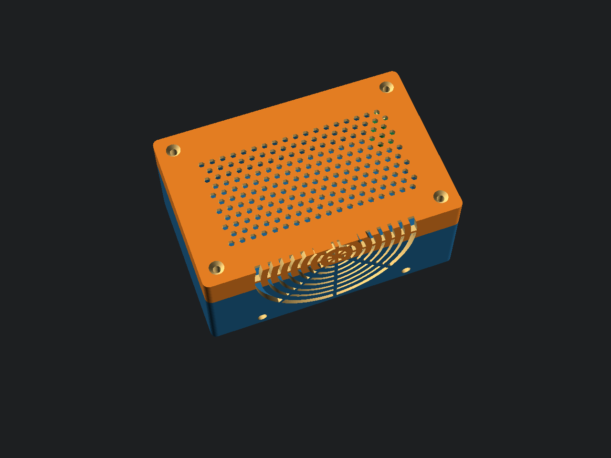

**Fan Grill — Rings 🔒**  
80 mm fan, concentric ring grill — classic look

</td>
<td width="50%">

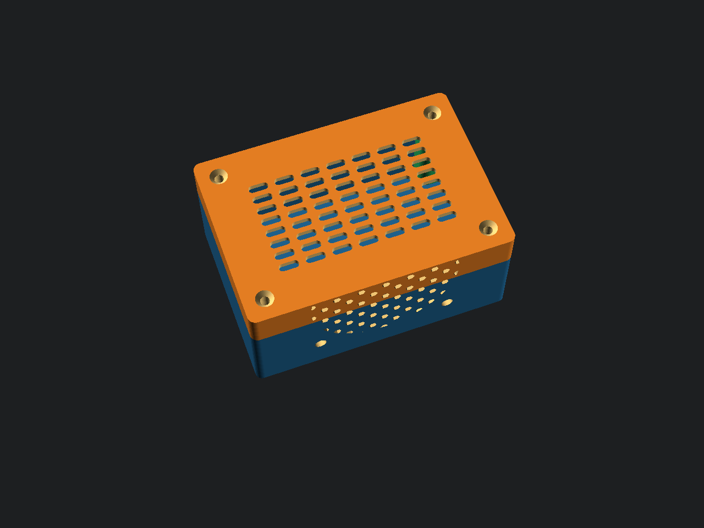

**Fan Grill — Honeycomb 🔒**  
60 mm fan, honeycomb grill — maximum airflow

</td>
</tr>
<tr>
<td width="50%">

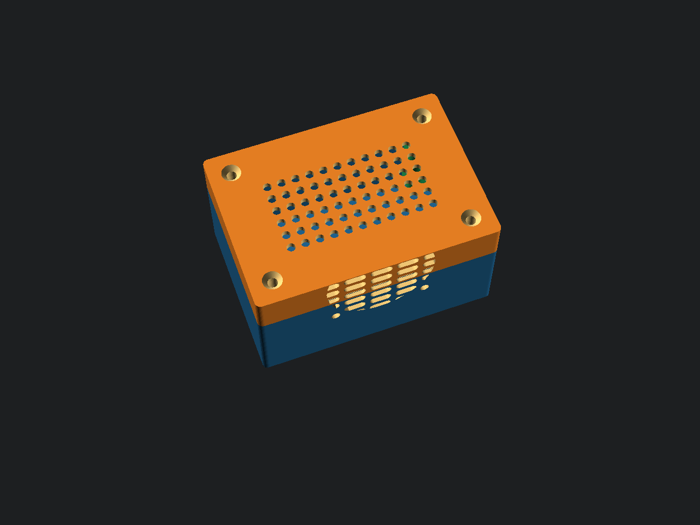

**Fan Grill — Slots 🔒**  
40 mm fan, horizontal slot grill — compact case

</td>
<td width="50%">

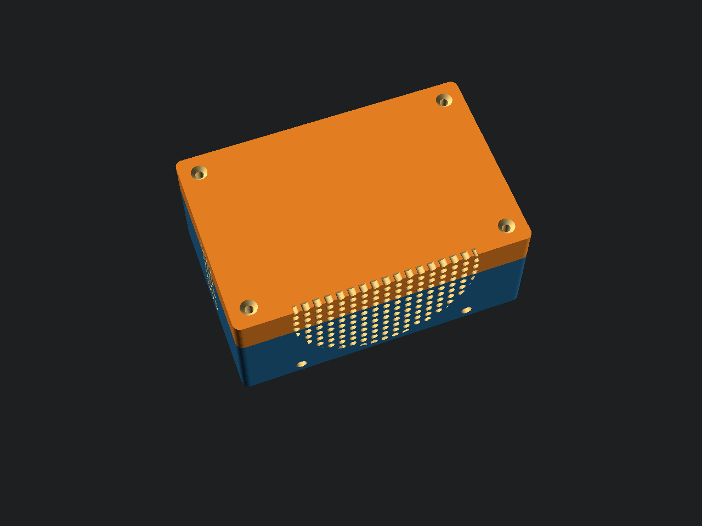

**Fan Grill — Holes 🔒**  
80 mm fan, circular holes grill pattern

</td>
</tr>
<tr>
<td width="50%">

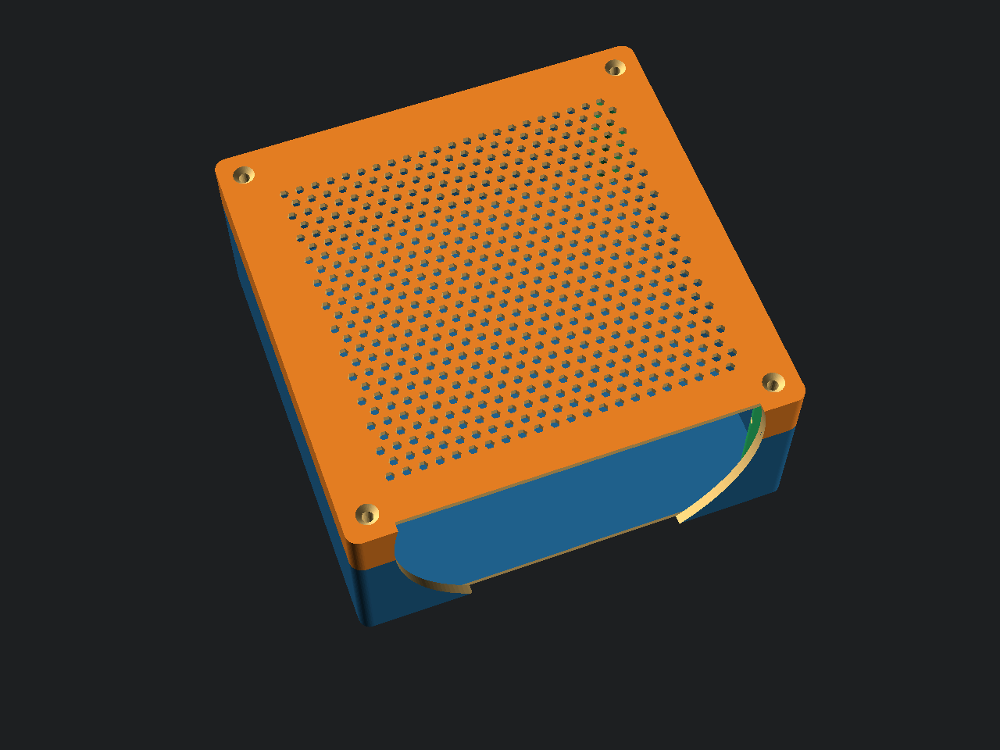

**Fan Grill — Open 🔒**  
120 mm fan, open cut-out — maximum airflow, minimal resistance

</td>
<td width="50%">

**PCB Standoffs 🔒**  
100×60×30 mm, 4× M3 standoffs, USB-C front, base only view

</td>
</tr>
<tr>
<td width="50%">

**DIN Rail TS-35 🔒**  
Industrial controller 130×80×60 mm, DIN snap-on clip, DB9 + DC Jack

</td>
<td width="50%">

**Snap-Fit Clips 🔒**  
Cantilever snap clips on X + Y sides — no screws needed

</td>
</tr>
<tr>
<td width="50%">

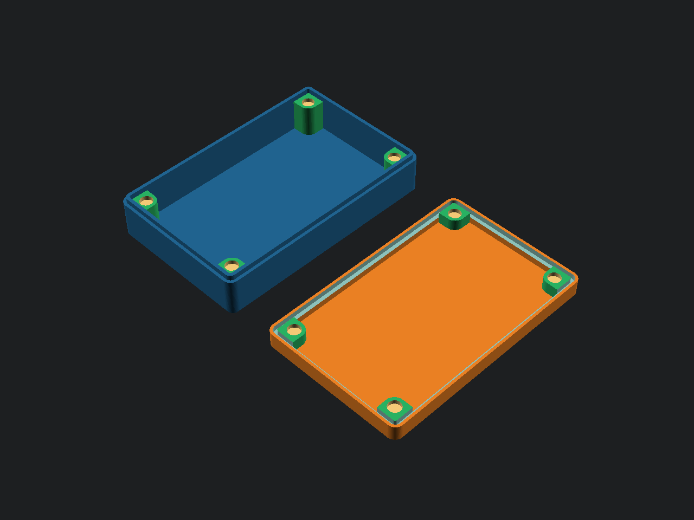

**Magnetic Closure 🔒**  
Flush magnet pockets in base and lid corners

</td>
<td width="50%">

**Mounting Ears 🔒**  
Panel-mount flanges with M4 holes on all 4 sides

</td>
</tr>
<tr>
<td width="50%">

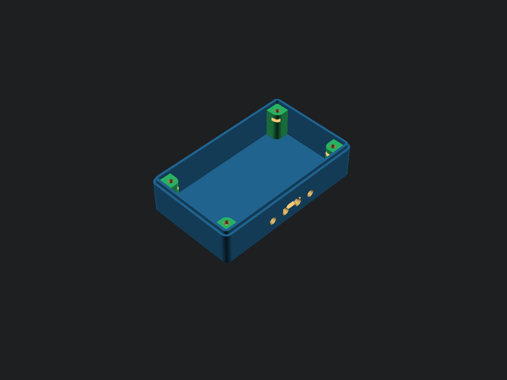

**LED Light Pipes 🔒**  
4 integrated light guides on front face for status LEDs

</td>
<td width="50%">

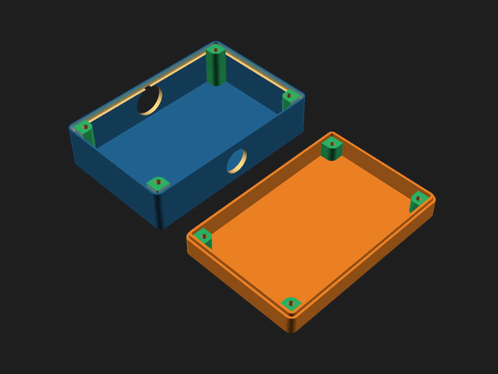

**IP54 Gasket + Heat-set 🔒**  
O-ring gasket groove for sealed enclosure, M3 heat-set inserts

</td>
</tr>
<tr>
<td width="50%">

**M16 Cable Glands 🔒**  
Industrial wire entries M16 threaded on left & right faces

</td>
<td width="50%">

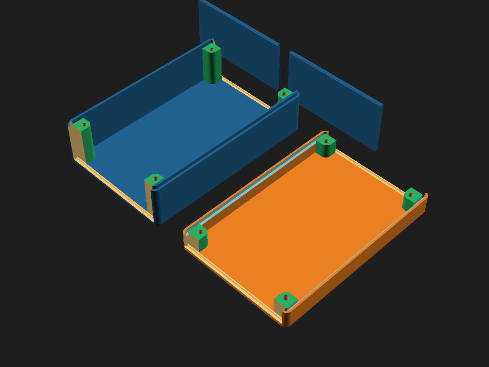

**Removable Side Panels 🔒**  
Tongue-and-groove slide-in walls — tool-free access, front+back

</td>
</tr>
<tr>
<td width="50%">

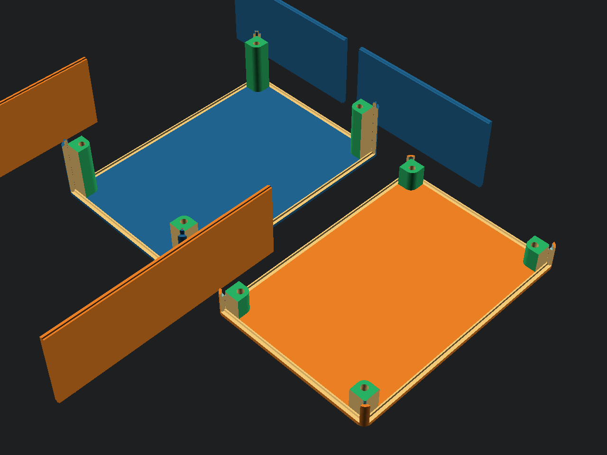

**Removable Panels — All 4 Sides 🔒**  
All four walls removable — slide-in from the sides

</td>
<td width="50%">

**Audio DI Box 🔒**  
115×75×40 mm, XLR 3-pin + Jack 6.35 mm + USB-C, rubber feet

</td>
</tr>
<tr>
<td width="50%">

**Full Honeycomb Ventilation 🔒**  
Honeycomb top + bottom + both sides — maximum airflow

</td>
<td width="50%">

**Custom Text Labels**  
Deboss on front face, emboss on top — any font, any face

</td>
</tr>
<tr>
<td width="50%">

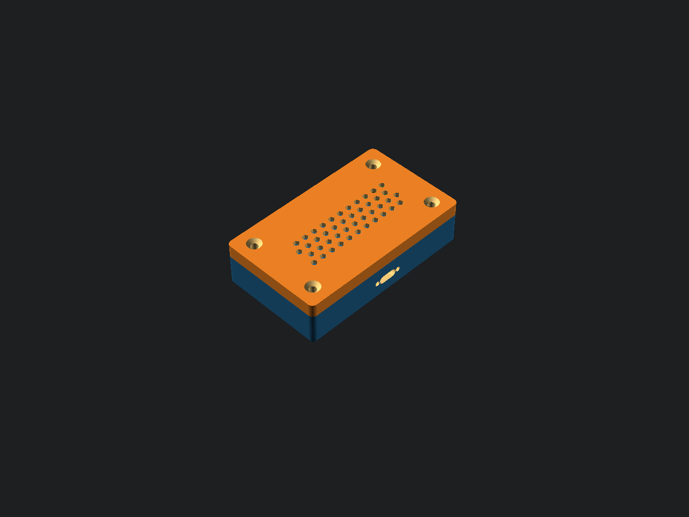

**IoT Sensor Node**  
85×50×21 mm, USB-C front, RJ45 back, honeycomb top

</td>
<td width="50%">

**Micro-Dongle — 50×35 mm**  
Smallest preset — USB dongle / BLE module size

</td>
</tr>
<tr>
<td width="50%">

**VESA 75×75 Mount 🔒**  
Wall/monitor mount pattern 75×75 mm — bolt directly to VESA bracket

</td>
<td width="50%">

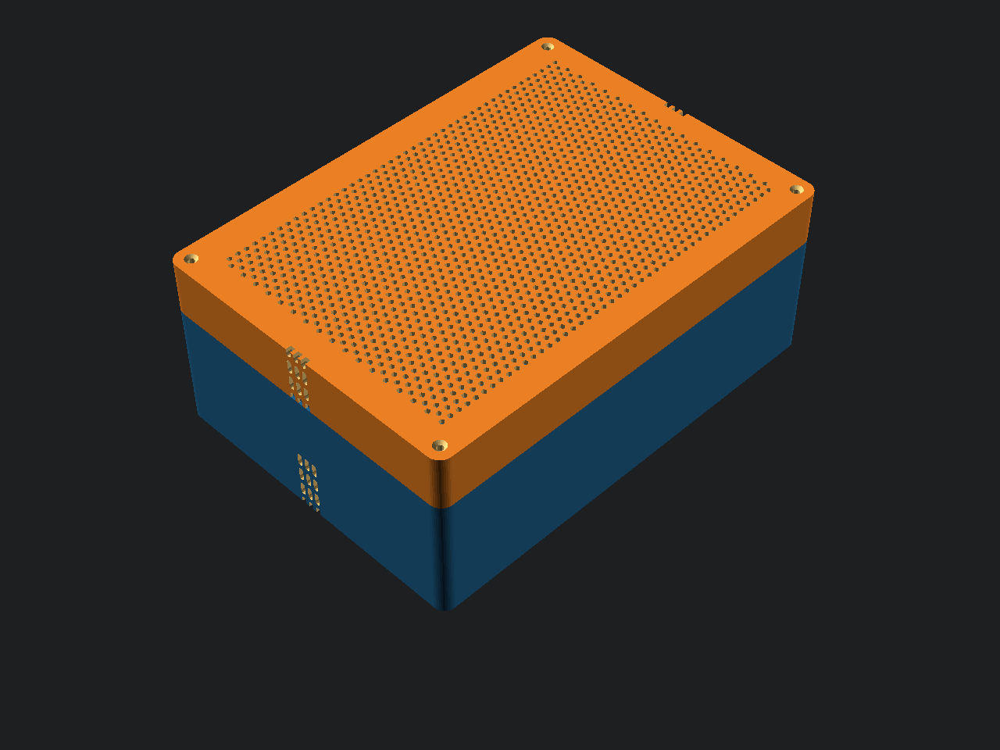

**Maxi Box 250×180 mm 🔒**  
Largest preset: 250×180×100 mm, honeycomb lid, side slots

</td>
</tr>
</table>

---

## Get the Full Feature Set

*26 connectors · 15 presets · Fan mounts · Snap-fit · Magnets · PCB standoffs · DIN rail · VESA · Mounting ears · IP54 gasket · LED light pipes · Cable glands*